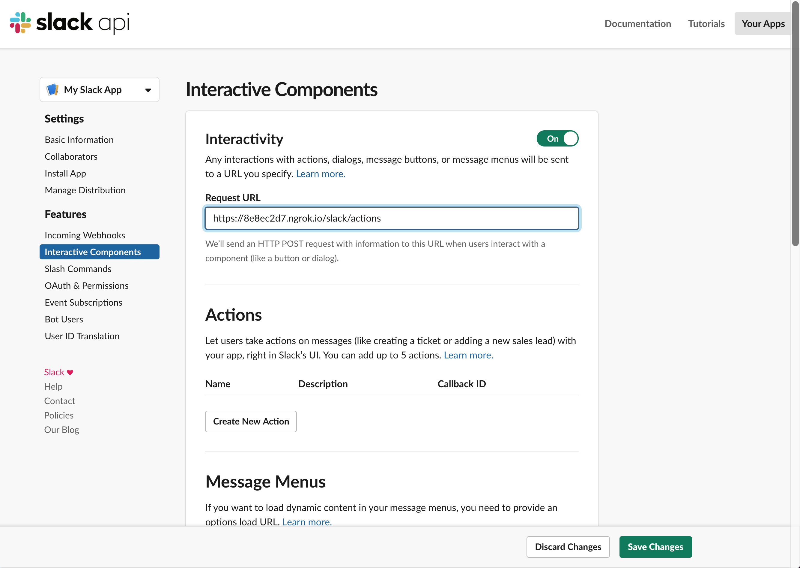

# Developing Slack apps locally

This tutorial is meant to guide developers through setting up and configuring a Slack app for local development.

Feel free to skip around to the specific sections relevant to you — we won't mind 🙂

## Create an app
Head over to [Create an app](https://tools.slack.dev/bolt-js/getting-started#create-an-app) within our Getting started with JavaScript for Bolt page for instructions on how to create a Slack app on [api.slack.com/apps](https://api.slack.com/apps).

## Tokens and installing apps
Head over to [Tokens and installing apps](https://tools.slack.dev/bolt-js/getting-started#tokens-and-installing-apps) within our Getting started with JavaScript for Bolt page for information on what tokens are, the [different kinds of tokens available](https://docs.slack.dev/authentication/tokens), how to create them on [api.slack.com/apps](https://api.slack.com/apps), how to install your app to a live Slack workspace, and finally how to retrieve your access token.

## Socket Mode vs. HTTP
Your app can [communicate with Slack using one of two methods](https://docs.slack.dev/apis/events-api):

1. [Socket Mode](https://docs.slack.dev/apis/events-api/using-socket-mode). Connect to Slack using a direct and long-lived socket connection. This is our recommended approach when getting started in local development because of its convenience. However, apps cannot use Socket Mode and also be listed in the [Slack Marketplace](https://docs.slack.dev/slack-marketplace/distributing-your-app-in-the-slack-marketplace). For that, you'll need to use [HTTP](#http). It is also important to remember that Socket Mode is more prone to network faults because the connection is a long-lived one.
2. [HTTP](https://docs.slack.dev/apis/events-api/using-http-request-urls). Expose your app using a public-facing URL that Slack will send HTTP requests to. This requires a few [additional steps](https://tools.slack.dev/bolt-js/tutorial/getting-started-http#setting-up-events-with-http) to set up, but may be more resilient to network disruptions than communication via Socket Mode.

This tutorial will cover how to set up your app using either approach.

### Socket Mode

Setting up your Node.js application for Socket Mode development is fast and easy with the [`@slack/socket-mode`](/socket-mode) package.

Once you've [created an app](#create-an-app), you will need to generate an app token. On your app's page on [api.slack.com/apps](https://api.slack.com/apps), under the main **Basic Information** page, scroll down to **App-Level Tokens**. Click **Generate Token and Scopes**, add a name for your app token, and click **Add Scope**. Choose `connections:write` and then click **Generate**. Copy and safely store the generated token - you'll need that when following the [Socket Mode package setup instructions](../socket-mode).

### HTTP

#### What is a Request URL?
A Request URL is a public URL where Slack can send HTTP POST requests with information about events, interactions and other happenings inside your Slack workspace.

For example, when a message is posted, a button is clicked, a dialog is submitted, or a user interacts with your app [using another interactive feature](https://docs.slack.dev/interactivity), Slack will send relevant information about that event to your app's Request URL such as the user who initiated the event, channel where the event occurred and other contextual details.

#### Using a local Request URL for development
If you're just getting started with your app development, you probably don't have a publicly accessible URL yet. Eventually, you'll want to set that up, but for now a development proxy like [ngrok](https://ngrok.com/) will do the job.

Once you've installed a development proxy, run it to begin forwarding requests to a specific port (we're using port 3000 for this example):

> ngrok: `ngrok http 3000`

The output should show a generated URL that you can use (Use the one that starts with `https://`). This URL will be the base of your request URL, in this case `https://8e8ec2d7.ngrok.io`.

#### Add the URL to your app configuration
At this point you have a public-facing URL. Now, let's add that to the **Interactivity and Shortcuts** and **Events Subscriptions** page. Under the **Request URL** box, go ahead and paste in your accessible URL.

### Subscribing to workspace events
If you want your app to be subscribed to workspace events (like when a reaction is added, when a user mentions your app, or [another Events API event](https://docs.slack.dev/reference/events)), you need to enable events for your app.

Start by clicking **Event Subscriptions** on the left sidebar. If your app is using HTTP to communicate with Slack, after you toggle the switch, you'll need to add a Request URL. This is similar to [adding a Request URL in the **Interactive Components** section](#what-is-a-request-url), but as described on this page, Slack will issue a `challenge` request to verify that your app's request URL can respond appropriately to incoming requests. Read through our [Request URL Configuration & Verification](https://docs.slack.dev/apis/events-api#subscribing) documentation for details on how to properly handle a `challenge` request.

On the **Event Subscriptions** page, you can add each event you want your app to subscribe to. In the tables below, you may add workspace events and bot events.

Most events require additional scopes (for example, the `reaction_added` event requires the `reactions:read` scope). You can add scopes to your app on the **OAuth & Permissions** page.

Once you've selected all the event types, be sure to save your changes.

Lastly, if you've added event types that require scopes your app did not previously have, you'll need to reinstall the app into the workspace(s) you'd like Slack to send your app new events. You can reinstall the app from the **Install App** page.

## Next steps
Hopefully this guide included information that's helpful to get you up and running with a Slack app. If something is missing, feel free to open a ticket or a pull request.

The different packages have code samples, explanations, and more resources to get you started writing the code in your app using our SDKs. The [README](https://github.com/slackapi/node-slack-sdk) has links to the packages and examples to get started.
