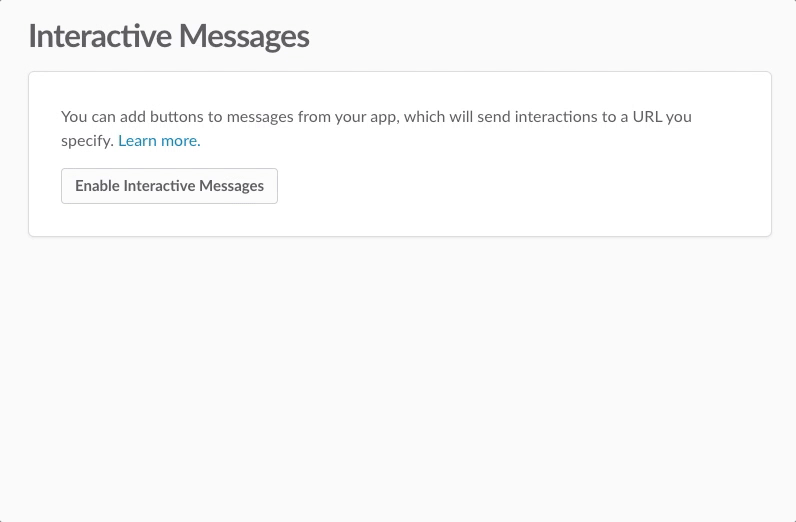
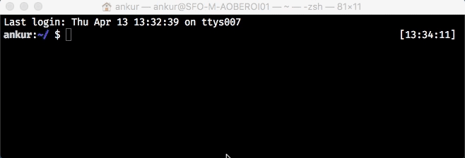

# Interactive Message Adapter for Node and Express

[](https://travis-ci.org/slackapi/node-slack-interactive-messages)
[](https://codecov.io/gh/slackapi/node-slack-interactive-messages)

The adapter provides a simplified API to route message actions and options in your app. It handles
common tasks and best practices so that you don't need to.

*  [Installation](#installation)
*  [Configuration](#configuration)
*  [Usage](#usage)
*  [Documentation](#documentation)
*  [Support](#support)

---

## Installation

```
$ npm install --save @slack/interactive-messages express body-parser
```

## Configuration

Before you can use [interactive messages](https://api.slack.com/interactive-messages) you must
[create a Slack App](https://api.slack.com/apps/new). On the **Basic Information** page, in the section
for **App Credentials**, note the **Verification Token**. You will need it to initialize the adapter.

Select the **Interactive Messages** feature, and enable it. Input your **Request URL**. If your app
will use dynamic menus, you also need to input a **Options URL**.



<details>
<summary>Getting a temporary Request URL for development</summary>

If you're just getting started with development, you may not have a publicly accessible URL for
your app. We recommend using a development proxy, such as [ngrok](https://ngrok.com/) or
[localtunnel](https://localtunnel.github.io/www/), to generate a URL that can forward requests to
your local machine. Once you've installed the development proxy of your choice, run it to begin
forwarding requests to a specific port (for example, 3000).

> ngrok: `ngrok http 3000`

> localtunnel: `lt --port 3000`



The output should show you a newly generated URL that you can use (ngrok will actually show you two
and we recommend the one that begins with "https"). Let's call this the base URL (for example,
`https://d9f6dad3.ngrok.io`)

To create the request URL, we add the path where our app listens for message actions onto the end of
the base URL. This will depend on your app, but if you are using the built-in HTTP server, the
path is `/slack/actions`. In this example the request URL would be
`https://d9f6dad3.ngrok.io/slack/actions`.

</details>

## Usage

The easiest way to start responding to interactive message actions is by using the built-in HTTP
server.

```javascript
const { createMessageAdapter } = require('@slack/interactive-messages');

// Initialize adapter using verification token from environment variables
const slackMessages = createMessageAdapter(process.env.SLACK_VERIFICATION_TOKEN);

// Attach action handlers by `callback_id`
// (See: https://api.slack.com/docs/interactive-message-field-guide#attachment_fields)
slackMessages.action('welcome_button', (payload) => {
  // `payload` is JSON that describes an interaction with a message.
  console.log(`The user ${payload.user.name} in team ${payload.team.domain} pressed the welcome button`);

  // The `actions` array contains details about the specific action (button press, menu selection, etc.)
  const action = payload.actions[0];
  console.log(`The button had name ${action.name} and value ${action.value}`);

  // You should return a JSON object which describes a message to replace the original.
  // Note that the payload contains a copy of the original message (`payload.original_message`).
  const replacement = payload.original_message;
  // Typically, you want to acknowledge the action and remove the interactive elements from the message
  const replacement.text =`Welcome ${payload.user.name}`;
  delete replacement.attachments[0].actions;
  return replacement;
});

// Start the built-in HTTP server
const port = process.env.PORT || 3000;
slackMessages.start(port).then(() => {
  console.log(`server listening on port ${port}`);
});
```

**NOTE**: To use the example above, your application must have already sent a message with a message
button whose `callback_id` is set to `'welcome_button'`. There are multiple ways to produce these
types of messages; including [incoming webhooks](https://api.slack.com/incoming-webhooks), or the
web API ([`chat.postMessage`](https://api.slack.com/methods/chat.postMessage),
[`chat.update`](https://api.slack.com/methods/chat.update), or
[`chat.unfurl`](https://api.slack.com/methods/chat.unfurl)).

### Using as Express middleware

For usage within an existing Express application, call the `expressMiddleware()` method on the
adapter and it will return a middleware function which you can add to your app. Be sure to add
the `body-parser` middleware before the message adapter as shown below.

```javascript
const http = require('http');
const { createMessageAdapter } = require('@slack/interactive-messages');

// Initialize using verification token from environment variables
const slackMessages = createMessageAdapter(process.env.SLACK_VERIFICATION_TOKEN);

// Initialize an Express application
const express = require('express');
const bodyParser = require('body-parser');
const app = express();

// You must use a body parser for the urlencoded format before mounting the adapter
app.use(bodyParser.urlencoded({ extended: false }));

// Mount the event handler on a route
// NOTE: you must mount to a path that matches the Request URL and/or Options URL that was configured
app.use('/slack/actions', slackMessages.expressMiddleware());

// Attach action handlers
slackMessages.action('welcome_button', (payload) => {
  // Same as above...
});

// Start the express application
const port = process.env.PORT || 3000;
http.createServer(app).listen(port, () => {
  console.log(`server listening on port ${port}`);
});
```

**Pro-Tip**: You can use this technique to combine usage of this adapter and the
[Events API adapter](https://github.com/slackapi/node-slack-events-api).

### Action matching

You can attach handlers for actions using more than just exact matches for the `"callback_id"` string.

```javascript
// Regular expressions can be used to match a computed callback_id or family of callback_id's
slackMessages.action(/welcome_(\w+)/, (payload) => { /* ... */ });

// Action types can be used to separate interactions that originate from buttons or menus
slackMessages.action({ type: 'select' }, (payload) => { /* ... */ });

// Handle actions from unfurls separately, since properties in the payload can differ
// (e.g. no access to original_message content)
slackMessages.action({ unfurl: true }, (payload) => { /* ... */ });

// Combine multiple properties to match actions as specifically as you desire
slackMessages.action({ callbackId: 'welcome', type: 'button', unfurl: false }, (p) => { /* ... */ });
```

These options should allow you to match actions in any way that makes sense for your app. Keep in
mind that only the first handler that matches an action will be invoked.

### Asynchronous responses

Sometimes you can't prepare a response to an action synchronously, especially in node where all I/O
is evented and you should not block. In these situations we recommend that you at least consider
updating the message to remove the interactive elements (often times actions aren't meant to trigger
more than once for an app). The adapter will invoke your handler with a `respond()` function as the
second argument so you can update the message asynchronously.

```javascript
slackMessages.action('my_callback', (payload, respond) => {
  // Do some asynchronous work (returns a Promise)
  doExpensiveThing()
    // Call respond() with a JSON object that represents a replacement message
    .then(formatMessage)
    .then(respond)
    // Set `replace_original` to `false` if the message is not meant to replace the original.
    .catch((error) => respond({ text: error.message, replace_original: false }));

  // Remove the interactivity from the message and update the content to acknowledge the interaction
  const updatedMessage = acknowledgeInteraction(payload.original_message);
  return updatedMessage;
});
```

You may also return a promise for a JSON object that represents the replacement message from the
action handler. This is not recommended unless you know the promise will resolve within 3 seconds.

If you do not return a value or return a falsy value from the handler, the message is not replaced.
This is not recommended in most cases, because the interactive attachments will stay on the message
and might be used again by the same or a different user.

### Options handling and matching

The adapter can also deal with
[options requests from interactive menus](https://api.slack.com/docs/message-menus#menu_dynamic).
If you are using the built-in HTTP server, the URL for options requests will be the same as the
request URL. If you are using the adapter with Express, the options URL can be anywhere you mount
the express middleware.

Options handlers are matched using the menu's `'callback_id'` as a string or a regular expression.

```javascript
const messageMiddleware = slackMessages.expressMiddleware();
// `app` is an express application
app.use('/slack/actions', messageMiddleware)
// in this example, we create a separate Options URL (different from the above Request URL) and
// still use the same instance of the adapter's middleware
app.use('/slack/options', messageMiddleware);

slackMessages.options('my_dynamic_menu_callback', (selection, respond) => {
  // You may return options synchronously or use the respond() argument to send them asynchronously
  // See https://api.slack.com/docs/message-menus#menu_dynamic for a description of a JSON object
  // that represents options.
  typeaheadLookup(selection.value)
    .then(formatMatchesAsOptions)
    .then(respond)
    .catch((error) => ({ options: [ { text: `Error: ${error.message}`, value: 'error' } ] }));
});
```

### Chaining

The `.action()` and `.options()` methods return the adapter object, which means the API is fluent
and supports chaining.

```javascript
slackMessages
  .action('make_order_1', orderStepOne)
  .action('make_order_2', orderStepTwo)
  .action('make_order_3', orderStepThree)
  .options('make_order_3', orderStepThreeOptions);
```

### Error handling

When an error occurs synchronously inside an action or options handler, the adapter will respond
to the Slack platform with a status code of 500, and this will result in the user seeing an error
within the channel.

For asynchronous code, `respond()` will return a promise. On success, the promise resolves to a
response object. On errors, the promise rejects and you should handle it with a `.catch()`.

## Support

Need help? Join the [Bot Developer Hangout](https://community.botkit.ai/) team and talk to us in
[#slack-api](https://dev4slack.slack.com/messages/slack-api/).

You can also [create an Issue](https://github.com/slackapi/node-slack-events-api/issues/new)
right here on GitHub.
